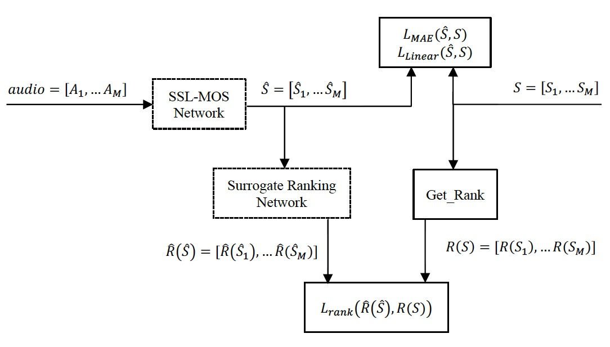

# Correlation Loss for MOS Prediction of Synthetic Speech

This is code for our paper in VoiceMOS Challenge:

"Correlation Loss for MOS Prediction of Synthetic Speech" Beibei Hu, Qiang Li.

Please cite this preprint if you use this code.

The baseline is https://github.com/nii-yamagishilab/mos-finetune-ssl

The selected models in our paper can be obtrained here: https://voicemos-models.ajmide.com/voicemos_models/index.html

## Dependencies:

 * Fairseq toolkit:  https://github.com/pytorch/fairseq  Make sure you can `import fairseq` in Python.
 * torch, numpy, scipy, torchaudio
 * I have exported my conda environment for this project to `environment.yml`
 * You also need to download a pretrained wav2vec2 model checkpoint.  These can be obtained here:  https://github.com/pytorch/fairseq/tree/main/examples/wav2vec  If you are using the `run_inference_for_challenge.py` script, one will be downloaded for you automatically.  Otherwise, please choose `wav2vec_small.pt`, `w2v_large_lv_fsh_swbd_cv.pt`, or `xlsr_53_56k.pt`. 
 * You also need to have a MOS dataset.  Datasets for the MOS prediction challenge will be released once the challenge starts.

## How to use
The usage is almost same as the instructions in `VoiceMOS_baseline_README.md`

We add two arguments for training or finetuning command: --enable_lccloss and --enable_srloss

--enable_lccloss:  add LCC loss

--enable_srloss: add Surrogate Ranking Loss

for example:

`python mos_fairseq.py --datadir data/phase1-main/DATA --fairseq_base_model fairseq/wav2vec_small.pt --outdir checkpoints --enable_lccloss --enable_srloss`

## License

BSD 3-Clause License

Copyright (c) 2021, Yamagishi Laboratory, National Institute of Informatics All rights reserved.

Redistribution and use in source and binary forms, with or without modification, are permitted provided that the following conditions are met:

 * Redistributions of source code must retain the above copyright notice, this list of conditions and the following disclaimer.

 * Redistributions in binary form must reproduce the above copyright notice, this list of conditions and the following disclaimer in the documentation and/or other materials provided with the distribution.

 * Neither the name of the copyright holder nor the names of its contributors may be used to endorse or promote products derived from this software without specific prior written permission.

THIS SOFTWARE IS PROVIDED BY THE COPYRIGHT HOLDERS AND CONTRIBUTORS "AS IS" AND ANY EXPRESS OR IMPLIED WARRANTIES, INCLUDING, BUT NOT LIMITED TO, THE IMPLIED WARRANTIES OF MERCHANTABILITY AND FITNESS FOR A PARTICULAR PURPOSE ARE DISCLAIMED. IN NO EVENT SHALL THE COPYRIGHT HOLDER OR CONTRIBUTORS BE LIABLE FOR ANY DIRECT, INDIRECT, INCIDENTAL, SPECIAL, EXEMPLARY, OR CONSEQUENTIAL DAMAGES (INCLUDING, BUT NOT LIMITED TO, PROCUREMENT OF SUBSTITUTE GOODS OR SERVICES; LOSS OF USE, DATA, OR PROFITS; OR BUSINESS INTERRUPTION) HOWEVER CAUSED AND ON ANY THEORY OF LIABILITY, WHETHER IN CONTRACT, STRICT LIABILITY, OR TORT (INCLUDING NEGLIGENCE OR OTHERWISE) ARISING IN ANY WAY OUT OF THE USE OF THIS SOFTWARE, EVEN IF ADVISED OF THE POSSIBILITY OF SUCH DAMAGE.
